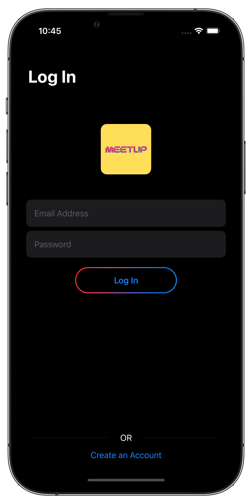
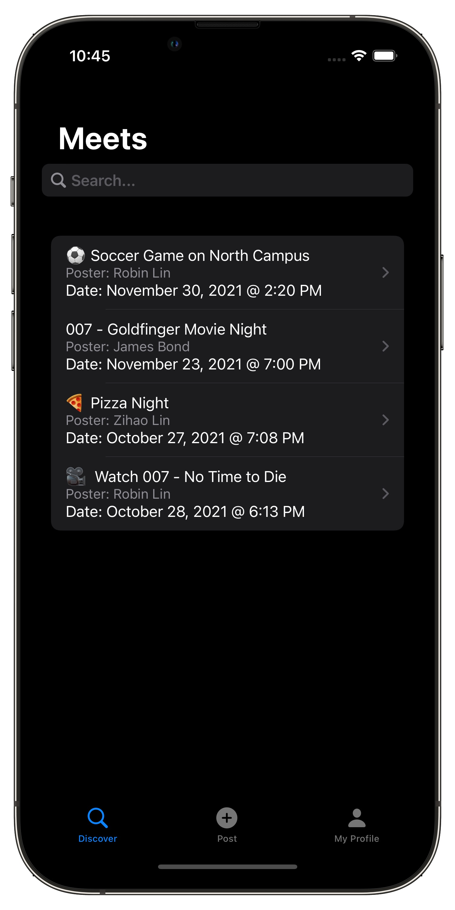
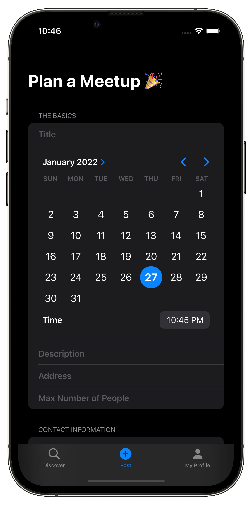
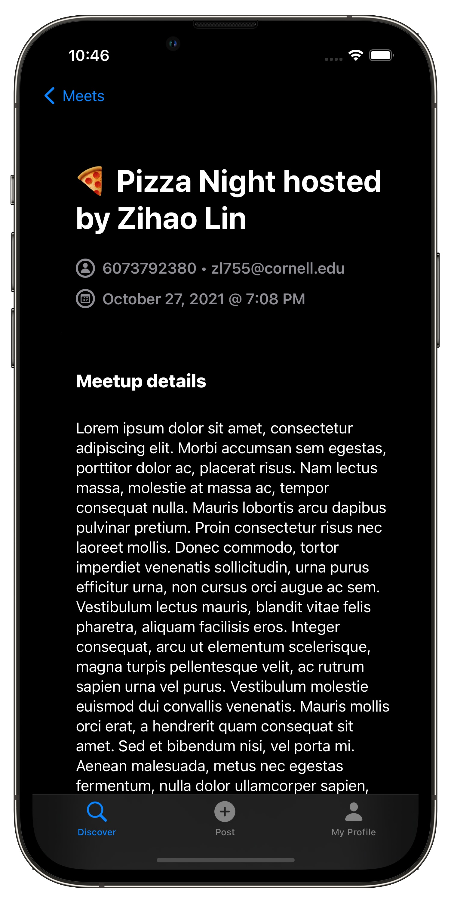
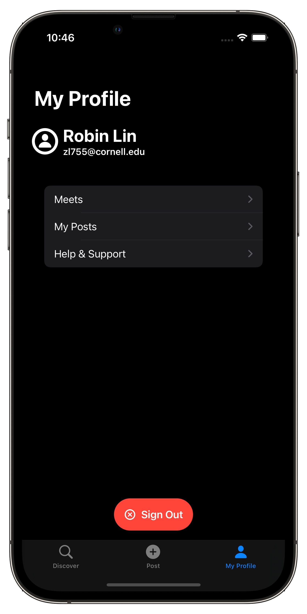

# big-red-hacks-2021

  

# ✍️ About 
🎊 `MeetUp` is an `iOS` app written using the latest verion of `Swift` programming language. The app enables you to safely and conveniently plan local meetups during the COVID-19 pandemic. The front-end was build natively using `SwiftUI`. For the back-end, multi-user sign-in/sign-up/sign-out is supported using `Google Firebase Authentication`, and `Google Firebase Firestore` is used as NoSQL cloud database.

  
  

  
  
  

